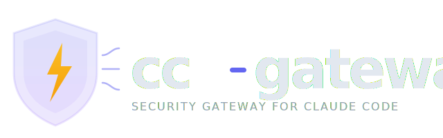

<p align="center">
  
</p>

<p align="center">
  Security observability and enforcement gateway for Claude Code.
</p>

---

cc-gateway gives companies full visibility and control over how their developers use Claude Code. It intercepts Claude Code's HTTP hook events to enforce security policies, log all activity, and provide real-time monitoring — without disrupting developer workflows.

## How It Works

Claude Code supports [HTTP hooks](https://code.claude.com/docs/en/hooks#http-hook-fields) that fire on key events during a coding session. cc-gateway acts as the hook server, receiving every event and applying your security policies before Claude Code proceeds.

```
Developer runs Claude Code
        |
        v
  Claude Code fires hook event (PreToolUse, PostToolUse, etc.)
        |
        v
  cc-gateway receives the event
        |
        +---> Policy Engine evaluates rules
        |         |
        |         +---> ALLOW: log event, return success
        |         +---> BLOCK: log violation, return block response
        |
        +---> Event stored in audit log
        |
        +---> TUI dashboard updates in real time
```

## Features

### Policy Enforcement

Define security policies in YAML. Block dangerous commands, restrict file access, limit tool usage by user or project.

```yaml
policies:
  - name: block-destructive-commands
    event: PreToolUse
    matcher: Bash
    conditions:
      - field: command
        pattern: "rm\\s+-rf\\s+/"
    action: block
    message: "Destructive rm -rf on root paths is not allowed"

  - name: block-secret-file-access
    event: PreToolUse
    matcher: Read
    conditions:
      - field: file_path
        pattern: "\\.(env|pem|key)$"
    action: block
    message: "Access to secret files is restricted"
```

Policies hot-reload when files change — no server restart needed.

### Audit Logging

Every Claude Code action is recorded: who did what, when, with which tool, what arguments, and whether it was allowed or blocked. Query logs by user, time range, tool, or policy outcome.

```bash
# Query recent violations
cc-gateway logs --status blocked --since 1h

# Export audit log for a specific user
cc-gateway logs --user alice@company.com --format json > audit.json
```

### Real-Time TUI Dashboard

Monitor Claude Code usage across your organization in real time.

```bash
cc-gateway monitor
```

The dashboard shows:

- **Live event stream** — every hook event as it happens
- **Active sessions** — who's using Claude Code right now
- **Violation feed** — policy violations with full context
- **Metrics panels** — tool usage breakdown, blocked/allowed ratio, top users
- **Session drill-down** — inspect a specific user's session in detail

### Metrics

- Tool usage frequency (Bash, Read, Write, Edit, etc.)
- Policy violations per user, per policy, per project
- Session count and duration
- Blocked vs. allowed ratio over time
- Peak usage hours

### Developer Onboarding

cc-gateway includes a [Claude Code plugin](https://code.claude.com/docs/en/plugins) that handles onboarding automatically:

1. Developer installs the cc-gateway plugin
2. Plugin authenticates via OAuth
3. HTTP hooks are configured automatically — no manual setup
4. All Claude Code activity flows through the gateway

## Quick Start

### Install

```bash
# From source
go install github.com/irad100/cc-gateway@latest

# Or download binary from releases
curl -fsSL https://github.com/irad100/cc-gateway/releases/latest/download/cc-gateway-$(uname -s)-$(uname -m) -o cc-gateway
chmod +x cc-gateway
```

### Run

```bash
# Initialize default config and policies
cc-gateway init

# Start the gateway server
cc-gateway serve --addr :8080

# In another terminal, monitor activity
cc-gateway monitor
```

### Configure Hook (Manual)

If not using the plugin, add to your Claude Code hooks config:

```json
{
  "hooks": {
    "PreToolUse": [
      {
        "matcher": "",
        "hooks": [
          {
            "type": "http",
            "url": "http://your-gateway:8080/hooks/pre-tool-use",
            "timeout": 30,
            "headers": {
              "Authorization": "Bearer $CC_GATEWAY_TOKEN"
            },
            "allowedEnvVars": ["CC_GATEWAY_TOKEN"]
          }
        ]
      }
    ],
    "PostToolUse": [
      {
        "matcher": "",
        "hooks": [
          {
            "type": "http",
            "url": "http://your-gateway:8080/hooks/post-tool-use",
            "timeout": 30,
            "headers": {
              "Authorization": "Bearer $CC_GATEWAY_TOKEN"
            },
            "allowedEnvVars": ["CC_GATEWAY_TOKEN"]
          }
        ]
      }
    ],
    "Notification": [
      {
        "matcher": "",
        "hooks": [
          {
            "type": "http",
            "url": "http://your-gateway:8080/hooks/notification",
            "timeout": 10,
            "headers": {
              "Authorization": "Bearer $CC_GATEWAY_TOKEN"
            },
            "allowedEnvVars": ["CC_GATEWAY_TOKEN"]
          }
        ]
      }
    ],
    "Stop": [
      {
        "matcher": "",
        "hooks": [
          {
            "type": "http",
            "url": "http://your-gateway:8080/hooks/stop",
            "timeout": 10,
            "headers": {
              "Authorization": "Bearer $CC_GATEWAY_TOKEN"
            },
            "allowedEnvVars": ["CC_GATEWAY_TOKEN"]
          }
        ]
      }
    ]
  }
}
```

## CLI Reference

| Command | Description |
|---------|-------------|
| `cc-gateway init` | Initialize config, policies directory, and database |
| `cc-gateway serve` | Start the gateway HTTP server |
| `cc-gateway monitor` | Launch the live TUI dashboard |
| `cc-gateway policies list` | List all loaded policies |
| `cc-gateway policies test` | Test a policy against a sample event |
| `cc-gateway policies validate` | Validate policy YAML files |
| `cc-gateway logs` | Query the audit log |
| `cc-gateway users list` | List registered users |
| `cc-gateway users activity` | Show per-user activity summary |
| `cc-gateway version` | Print version information |

## Configuration

cc-gateway is configured via `cc-gateway.yaml`:

```yaml
server:
  addr: ":8080"
  tls:
    cert: ""
    key: ""

auth:
  oauth:
    client_id: ""
    client_secret: ""
    issuer: ""

storage:
  driver: sqlite
  dsn: "cc-gateway.db"

policies:
  dir: "./policies"
  watch: true

logging:
  level: info
  format: json
```

## Project Structure

```
cc-gateway/
  cmd/
    cc-gateway/         # CLI entrypoint
  internal/
    server/             # HTTP server and hook handlers
    policy/             # Policy engine and YAML parsing
    storage/            # SQLite event store
    auth/               # OAuth and token management
    tui/                # Bubble Tea TUI dashboard
    metrics/            # Metrics collection and aggregation
  plugin/               # Claude Code plugin manifest
  policies/             # Default policy files
  docs/
    plans/              # Design documents
```

## License

MIT
